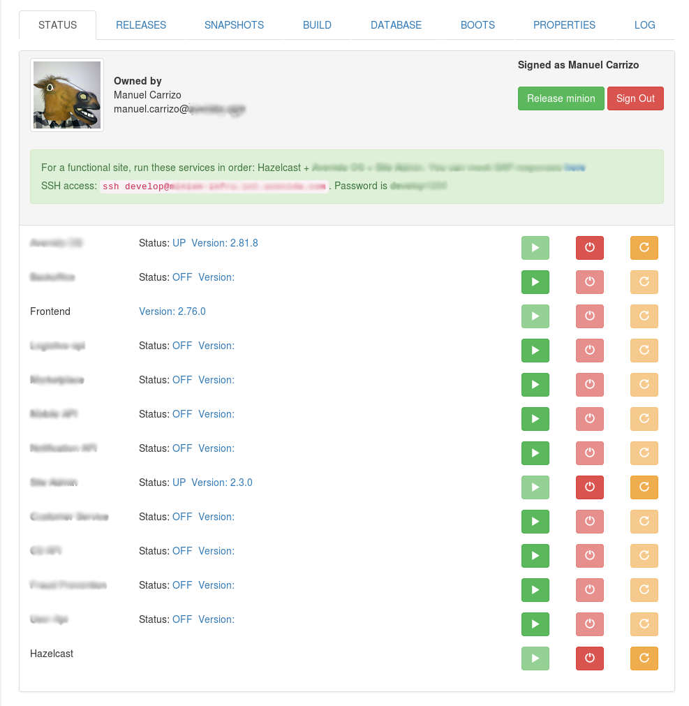
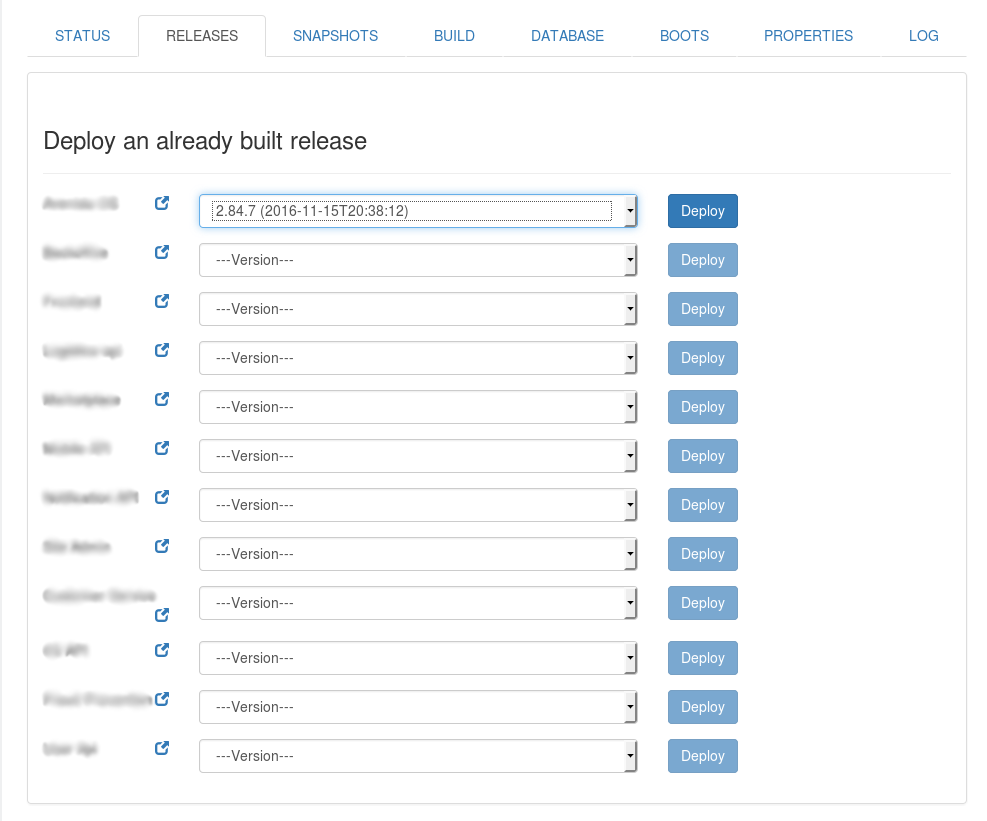
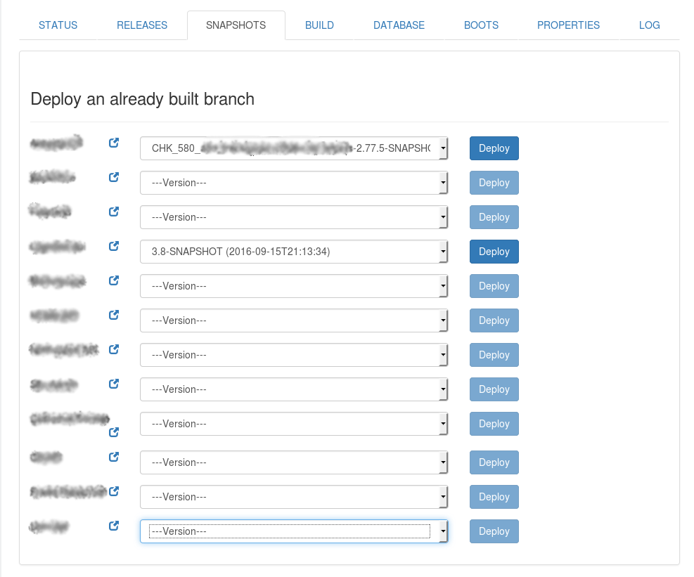
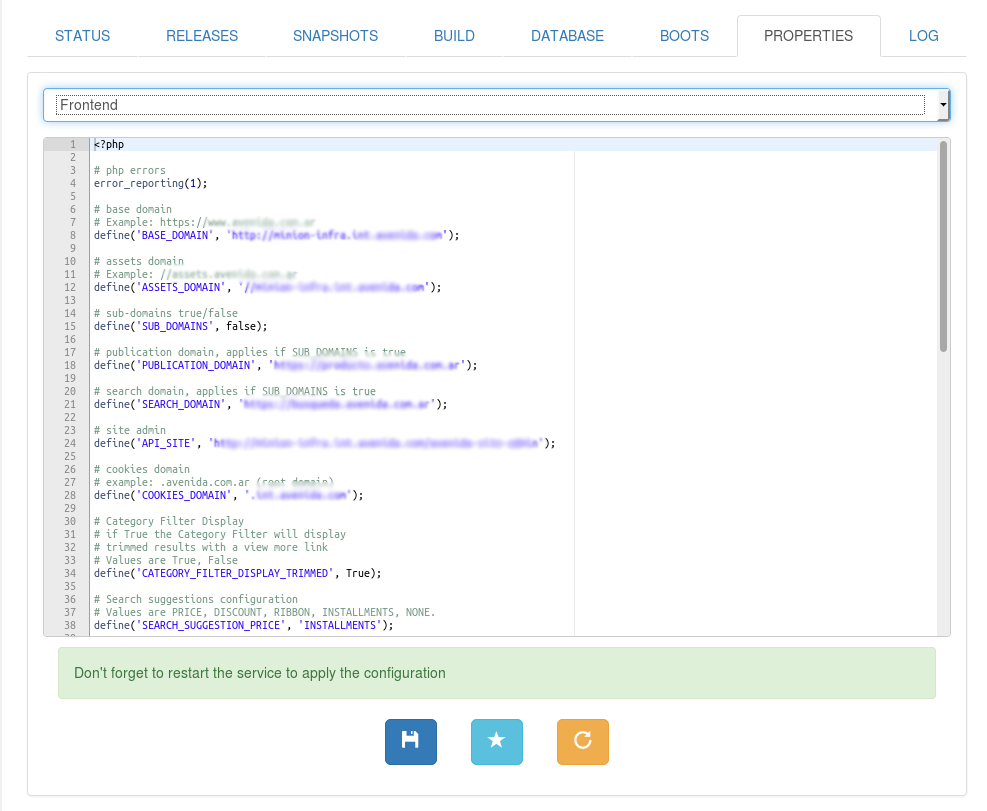
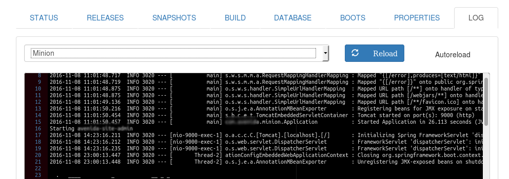

### Status
Here you can see all the services running, versions installed and start/stop/restart services.
Information is obtained using Spring Boot `health` and `info` endpoints.

### Releases
Here you can see the `releases` versions on Sonatype Nexus per artifact and start a deploy.

### Snapshots
Here you can see the `snapshots` versions on Sonatype Nexus per artifact and start a deploy.

### Build
This tab lets you see all the branches on the projects and schedule a build on Jenkins, after the build is done the artifact is automatically deployed on this minion.

### Properties
Edit a configuration file per service, lets you create a copy of the current configuration and restore that copy later.

### Log
See the log files of each service, the user can activate autoreloading or reload manually.

